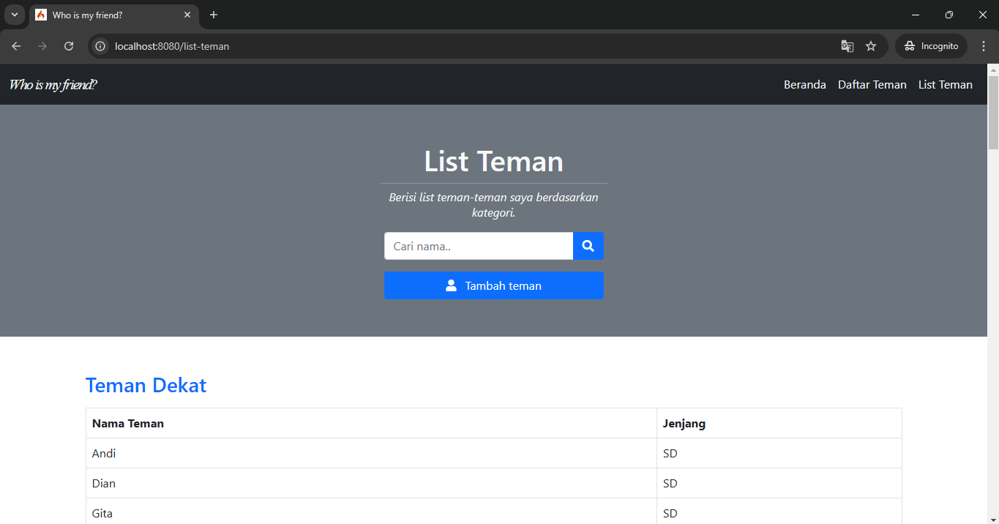

# Who is My Friend? - Web Application
- **Achmed Hibatillah**  
  Fakultas Ilmu Komputer, Universitas Brawijaya

## Deskripsi

"Who is My Friend?" adalah aplikasi web yang dirancang untuk membantu pengguna mengelola data teman-teman mereka berdasarkan jenjang pendidikan dan kategori. Aplikasi ini memiliki berbagai menu untuk menampilkan daftar teman berdasarkan jenjang pendidikan atau kategori yang berbeda. Pengguna juga dapat menambahkan teman baru ke dalam daftar.

Aplikasi ini dibangun menggunakan **PHP 8.3** dan menggunakan framework **CodeIgniter 4.5.6**.

---

## Fitur Menu

### 1. **Landing Page**
Halaman utama aplikasi ini menampilkan identitas saya (pemilik aplikasi) dan memiliki dua tombol utama untuk mengakses menu lainnya: **"Daftar Teman"** dan **"List Teman"**. Pada halaman ini, Anda akan menemukan tombol yang mengarahkan pengguna ke halaman **Daftar Teman** dan **List Teman**.

**Tampilan Landing Page:**


### 2. **Daftar Teman**
Halaman **Daftar Teman** memungkinkan pengguna untuk melihat seluruh teman berdasarkan jenjang pendidikan mereka. Daftar ini dikelompokkan berdasarkan jenjang seperti SD, SMP, SMA, Kuliah, dan Kerja. Pada halaman ini, Anda dapat melihat daftar teman yang terdaftar dalam database sesuai dengan jenjang pendidikan masing-masing.

**Tampilan Daftar Teman:**


### 3. **List Teman**
Halaman **List Teman** memungkinkan pengguna untuk melihat seluruh teman berdasarkan kategori tertentu, seperti "Teman Dekat", "Teman Curhat", "Teman Nongkrong", "Teman Organisasi", dan "Teman Belajar". Pengguna dapat dengan mudah menavigasi daftar teman berdasarkan kategori yang telah ditentukan.

**Tampilan List Teman:**


### 4. **Tambah Teman**
Halaman **Tambah Teman** menyediakan formulir untuk menambahkan data teman baru ke dalam database. Pengguna dapat mengisi nama teman dan memilih jenjang pendidikan serta kategori yang sesuai dengan teman tersebut. Setelah mengisi formulir, pengguna dapat menambahkan teman baru ke dalam daftar.

**Tampilan Tambah Teman:**


---

## Struktur Database

Aplikasi ini menggunakan 6 tabel utama dalam database untuk menyimpan data teman berdasarkan kategori dan jenjang pendidikan mereka. Berikut adalah struktur tabel yang digunakan dalam aplikasi:

1. **kategori_teman**
   - Menyimpan kategori teman (misalnya: Dekat, Curhat, Nongkrong, dll.)
   - Kolom: `id_kategori_teman`, `kategori_teman`

2. **teman_sd**
   - Menyimpan data teman yang berasal dari jenjang SD.
   - Kolom: `id_teman_sd`, `nama_teman_sd`, `id_kategori_teman`

3. **teman_smp**
   - Menyimpan data teman yang berasal dari jenjang SMP.
   - Kolom: `id_teman_smp`, `nama_teman_smp`, `id_kategori_teman`

4. **teman_sma**
   - Menyimpan data teman yang berasal dari jenjang SMA.
   - Kolom: `id_teman_sma`, `nama_teman_sma`, `id_kategori_teman`

5. **teman_kuliah**
   - Menyimpan data teman yang berasal dari jenjang Kuliah.
   - Kolom: `id_teman_kuliah`, `nama_teman_kuliah`, `id_kategori_teman`

6. **teman_kerja**
   - Menyimpan data teman yang berasal dari jenjang Kerja.
   - Kolom: `id_teman_kerja`, `nama_teman_kerja`, `id_kategori_teman`

*Seluruh tabel ini tersimpan dalam migration file.*

---

## Teknologi yang Digunakan

- **PHP 8.3**: Versi terbaru PHP yang digunakan untuk membangun aplikasi ini.
- **CodeIgniter 4.5.6**: Framework PHP yang digunakan untuk membangun aplikasi web ini.
- **HTML, CSS, JavaScript**: Teknologi frontend untuk tampilan dan interaktivitas pengguna.
- **MySQL/MariaDB**: Sistem manajemen basis data yang digunakan untuk menyimpan data teman-teman.

---

## Cara Menjalankan Aplikasi

### Langkah-langkah Instalasi:

1. **Clone repositori** ke direktori lokal Anda:
   ```bash
   git clone https://github.com/achmedhibatillah/teman-list-project

2. **Buat schema baru di MySQL Anda** melalui query berikut:
   ```bash
   create schema teman_project

3. Dalam direktori teman-project, **migrasikan databasenya** dengan menjalankan perintah ini di terminal:
   ```bash
   php spark migrate

3. Aplikasi teman-project siap dijalankan di server lokal Anda!
